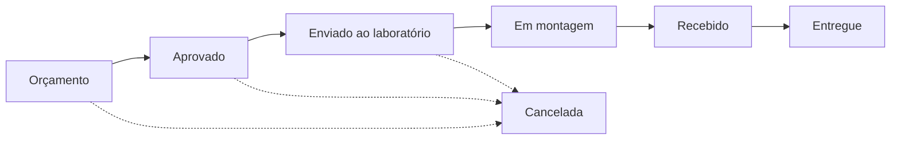
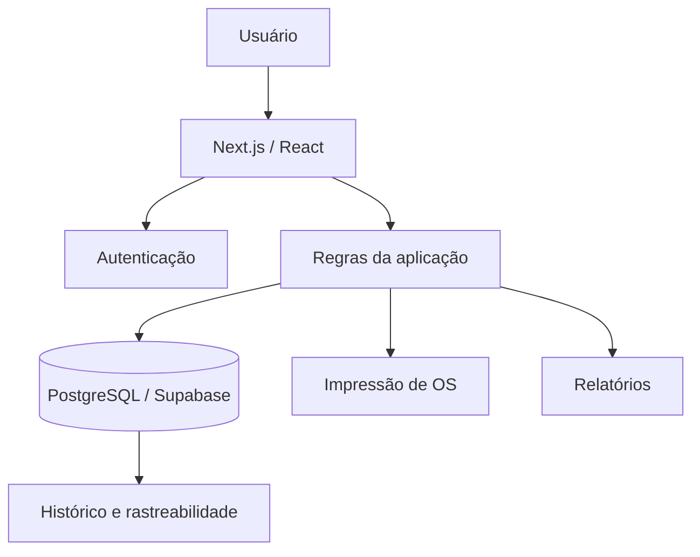

# Sistema SENSO — Case Study

> Gestão integrada para uma operação de ótica, da necessidade de negócio à aplicação web funcional.

**Autor:** Isaac Matheus Santos  
**Portfólio:** https://isaac-matheus.vercel.app/  
**Status:** projeto real em evolução; dados exibidos nas telas deste repositório são fictícios.

## Visão geral

O **Sistema SENSO** nasceu da necessidade de organizar em um único fluxo processos que, em uma operação de ótica, passam por clientes, receitas ópticas, lentes, armações, vendas, pagamentos, laboratórios, ordens de serviço e entrega.

O projeto foi concebido como uma ferramenta operacional: primeiro foram modelados o processo, as regras de negócio e os pontos de controle; depois esses requisitos foram transformados em uma aplicação web.

Este repositório é um **case study público e sanitizado**. O código de produção, credenciais, dados reais, regras comerciais sensíveis e estrutura completa do banco permanecem privados.

## Problema de negócio

O atendimento de uma ótica envolve várias informações que precisam permanecer relacionadas durante todo o ciclo do pedido:

```text
Cliente
  ↓
Receita óptica
  ↓
Lente + Armação
  ↓
Orçamento / Venda
  ↓
Pagamento
  ↓
Laboratório
  ↓
Montagem
  ↓
Recebimento
  ↓
Entrega
```

Sem um fluxo integrado, aumentam os riscos de perda de informação, retrabalho, inconsistências de status e dificuldade de acompanhamento da ordem de serviço.

## Solução

A solução foi estruturada para centralizar o processo e estabelecer regras operacionais claras, mantendo rastreabilidade entre as etapas.

### Principais módulos

- Clientes
- Receitas ópticas — visão simples e multifocal
- Lentes
- Armações
- Vendas e ordens de serviço
- Pagamentos
- Laboratórios
- Impressão de via do cliente e via técnica do laboratório
- Relatórios e histórico de status

## Fluxo da ordem de serviço



O fluxo foi modelado para representar o processo físico da operação e permitir que cada pedido tenha um estado identificável.

## Regras de negócio demonstradas

Algumas regras incorporadas ao projeto:

- aprovação condicionada ao registro do pagamento mínimo definido pela operação;
- suporte a múltiplas formas de pagamento;
- bloqueios de edição após etapas críticas do processo;
- manutenção do histórico mesmo em ordens canceladas;
- separação entre informação comercial e informação técnica destinada ao laboratório;
- histórico de mudanças de status da OS;
- tratamento específico para armação própria e armação fornecida pelo cliente;
- validações específicas para prescrições ópticas.

Mais detalhes: [docs/regras-de-negocio.md](docs/regras-de-negocio.md)

## Stack

| Camada | Tecnologia |
| --- | --- |
| Front-end | Next.js, React, TypeScript, Tailwind CSS |
| Back-end / dados | Supabase, PostgreSQL |
| Autenticação | Supabase Auth / SSR |
| Deploy | Vercel |
| Arquitetura | Next.js App Router |

O projeto principal utiliza Next.js 16, React 19, TypeScript e integração com Supabase para autenticação e persistência.

## Arquitetura simplificada



A versão atual integra aplicação, autenticação e persistência por meio do Supabase. Para a próxima evolução, a arquitetura será revisada visando reduzir acoplamento e melhorar a separação de responsabilidades.

Mais detalhes: [docs/arquitetura.md](docs/arquitetura.md)

## Telas demonstrativas

### Vendas e ordens de serviço


### Detalhe da ordem de serviço


### Receita óptica


### Clientes


### Via técnica do laboratório


> Todos os nomes, valores, prescrições e demais dados exibidos nas telas são fictícios e foram criados exclusivamente para demonstração.

## Minha atuação

No projeto, fui responsável pela combinação entre visão operacional e execução técnica:

- levantamento e organização dos requisitos;
- desenho do fluxo operacional;
- definição das regras de negócio;
- modelagem inicial dos dados;
- desenvolvimento da aplicação;
- testes dos fluxos principais;
- implantação web;
- revisão de usabilidade e evolução do produto.

O ponto central do case não é apenas o desenvolvimento do software, mas a transformação de um processo real em uma solução digital utilizável.

## Competências demonstradas

`Processos` · `Operações` · `Requisitos` · `Regras de negócio` · `Modelagem de dados` · `Next.js` · `TypeScript` · `PostgreSQL` · `Supabase` · `Testes` · `Produto`

## Exemplos técnicos sanitizados

Este repositório inclui exemplos criados exclusivamente para demonstração pública e não representam cópia do código de produção:

- [examples/status-flow.ts](examples/status-flow.ts) — exemplo de validação de transições de status;
- [examples/data-model.sql](examples/data-model.sql) — modelo reduzido de dados para ilustrar relacionamentos.

## Próxima evolução — SENSO V2

A próxima versão tem duas diretrizes principais:

1. interface verdadeiramente responsiva, mantendo uma boa experiência tanto em **mobile/PWA quanto em desktop**;
2. revisão da arquitetura de dados e autenticação para diminuir o acoplamento da aplicação ao provedor de banco e facilitar manutenção e evolução.

Mais detalhes: [docs/roadmap-v2.md](docs/roadmap-v2.md)

## Sobre este repositório

Este repositório existe para apresentar o projeto profissionalmente sem expor informações privadas da operação. Por esse motivo, ele contém documentação, imagens demonstrativas e exemplos sanitizados — não o código-fonte integral do sistema em produção.

---

### English summary

**SENSO** is an optical-store operations management system designed to centralize customers, prescriptions, lenses, frames, sales, payments, labs and work orders. I worked from process mapping and business rules through data modeling, development, testing and deployment. This public repository is a sanitized case study; production source code and real business data remain private.
