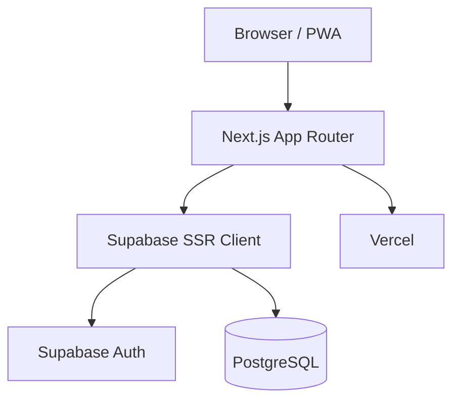

# Arquitetura — visão simplificada

## Objetivo

A arquitetura da primeira versão priorizou velocidade de implementação e integração entre interface, autenticação e persistência.

## Decisões principais

- **Next.js App Router** como base da aplicação web.
- **TypeScript** para reduzir erros e tornar contratos de dados mais explícitos.
- **Supabase** para banco PostgreSQL e autenticação.
- **Vercel** para entrega e hospedagem da aplicação.
- **RLS / políticas de acesso** como parte da proteção de dados no back-end.

## Aprendizados

A integração acelerou a construção da V1, mas também aumentou o acoplamento entre autenticação, banco e aplicação. A revisão planejada para a V2 busca estabelecer limites mais claros entre essas camadas e melhorar a capacidade de troca ou evolução de infraestrutura.
